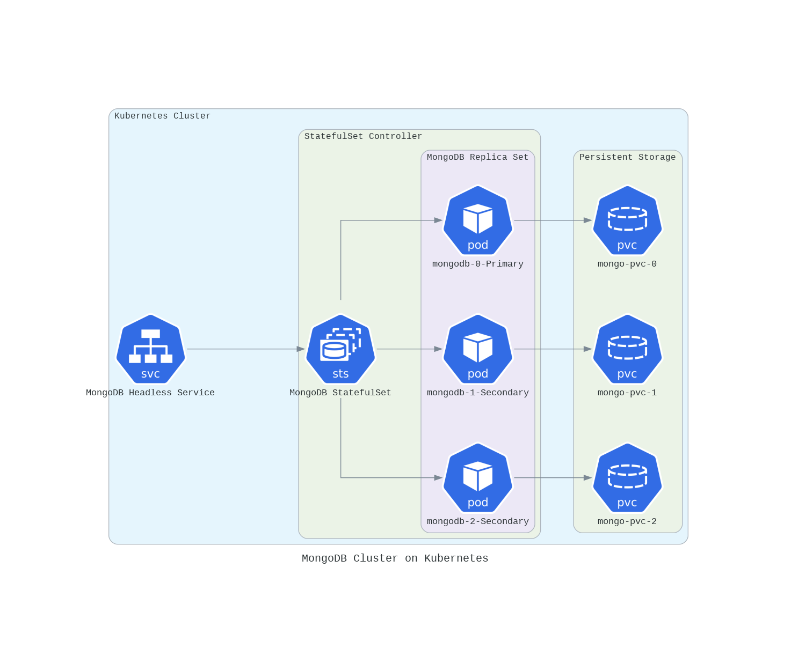

# Kubernetes Deployment for 3-Tier Node.js Application

This repository contains the necessary configurations and Kubernetes manifests to deploy a 3-tier Node.js application on Kubernetes. The application consists of a frontend (React), backend (Node.js), and a MongoDB database. The setup is optimized for scalability, maintainability, and ease of deployment.

## Project Structure

```plaintext
kubernetes/
├── configmaps/
│   ├── backend-configmap.yaml       # ConfigMap for backend environment variables
│   └── frontend-configmap.yaml      # ConfigMap for frontend environment variables
├── deployments/
│   ├── backend-deployment.yaml      # Deployment configuration for the backend
│   ├── frontend-deployment.yaml     # Deployment configuration for the frontend
│   ├── mongodb-deployment.yaml      # Deployment configuration for MongoDB
│   └── mongodb-pvc.yaml             # Persistent Volume Claim for MongoDB data
└── services/
    ├── backend-service.yaml         # Service configuration for the backend
    ├── frontend-service.yaml        # Service configuration for the frontend
    └── mongodb-service.yaml         # Service configuration for MongoDB
```
## Mongodb Cluster 


This diagram represents a **MongoDB Cluster on Kubernetes** using StatefulSets, Persistent Volumes, and Headless Services.

### Components

1. **Kubernetes Cluster**: 
   - The overall Kubernetes environment that houses the services, pods, StatefulSets, and persistent storage.

2. **MongoDB Headless Service**:
   - A **Headless Service** is used for StatefulSets to ensure each pod has a stable network identity. In this case, the service is named `MongoDB Headless Service`.

3. **StatefulSet Controller**:
   - The `StatefulSet` controller is responsible for managing the MongoDB Replica Set. It ensures that each pod gets a persistent identity, which is crucial for maintaining the replication and consistency required by MongoDB.
   - In this diagram, the StatefulSet is named `MongoDB StatefulSet`.

4. **MongoDB Replica Set**:
   - The **Replica Set** consists of three MongoDB pods:
     - `mongodb-0-Primary`: The primary replica.
     - `mongodb-1-Secondary`: A secondary replica.
     - `mongodb-2-Secondary`: Another secondary replica.
   - Each pod runs a copy of MongoDB and can be used to serve read or write operations, depending on whether it is the primary or secondary node.

5. **Persistent Storage**:
   - Each MongoDB pod is associated with a **PersistentVolumeClaim (PVC)**. These claims are used to request storage from Kubernetes to ensure that the data stored by MongoDB is persistent across pod restarts.
   - The PVCs are named `mongo-pvc-0`, `mongo-pvc-1`, and `mongo-pvc-2`.

### Connections

- **Headless Service to StatefulSet**: 
  - The **Headless Service** connects to the **StatefulSet**, ensuring that the MongoDB pods can be accessed individually via DNS names (e.g., `mongodb-0.mongodb-headless-service`).

- **StatefulSet to Pods**: 
  - The **StatefulSet** manages the lifecycle of the MongoDB pods, ensuring the pods are properly scheduled and configured.

- **Pods to Persistent Storage**:
  - Each MongoDB pod is connected to a corresponding **PersistentVolumeClaim**, ensuring that the pod has persistent storage for storing MongoDB data.

### Diagram Overview
This diagram illustrates how the various Kubernetes components interact to form a robust MongoDB cluster, providing high availability and persistent storage.

## Setup Instructions

Follow these steps to deploy the 3-tier Node.js application on Kubernetes:

### 1. Apply ConfigMaps

ConfigMaps store configuration data for the backend, frontend, and general application settings. Apply the following ConfigMaps:

```bash
kubectl apply -f kubernetes/configmaps/backend-configmap.yaml
kubectl apply -f kubernetes/configmaps/frontend-configmap.yaml
kubectl apply -f kubernetes/configmaps/mongodb-configmap.yaml

```

### 2. Apply Deployments

Next, deploy the backend, frontend, and MongoDB components to Kubernetes:

```bash
kubectl apply -f kubernetes/deployments/mongodb-deployment.yaml
```

You must create a MongoDB cluster by executing the following command in the command line:

```bash
kubectl exec -it <pod_name> -- bash -c "
mongosh --eval 'rs.initiate({
  _id: \"my_cluster\",
  members: [
    { _id: 0, host: \"mongodb-0.mongodb-service.default.svc.cluster.local:27017\" },
    { _id: 1, host: \"mongodb-1.mongodb-service.default.svc.cluster.local:27017\" },
    { _id: 2, host: \"mongodb-2.mongodb-service.default.svc.cluster.local:27017\" }
  ]
});' && \
mongosh --eval 'use admin' && \
mongosh --eval 'db.createUser({
  user: \"admin\",
  pwd: \"admin\",  
  roles: [{ role: \"root\", db: \"admin\" }]
});'"
```

Then, deploy the backend and frontend services with the following commands:

```bash 
kubectl apply -f kubernetes/deployments/backend-deployment.yaml
kubectl apply -f kubernetes/deployments/frontend-deployment.yaml
```


### 3. Apply Persistent Volume Claim for MongoDB

MongoDB needs persistent storage for data. Apply the persistent volume claim:

```bash
kubectl apply -f kubernetes/deployments/mongodb-pvc.yaml
```

### 4. Apply Services

Expose the frontend, backend, and MongoDB services to facilitate communication between components:

```bash
kubectl apply -f kubernetes/services/mongodb-service.yaml
```
after mongodb pod running must make them work as cluster 
```bash
kubectl apply -f kubernetes/services/backend-service.yaml
kubectl apply -f kubernetes/services/frontend-service.yaml
```

### 5. Verify the Deployment

After applying the configurations, verify that all resources have been successfully deployed:

```bash
kubectl get pods
kubectl get services
kubectl get deployments
```

Check if the pods are running and the services are properly exposed. You can use the `kubectl describe pod <pod-name>` command to inspect the status and logs of individual pods if necessary.

### 6. Access the Application

- **Frontend**: If using a `NodePort` or LoadBalancer type service for the frontend, access the frontend application via the assigned node port or external IP.
- **Backend**: The backend service is exposed internally and will be used by the frontend application to make API calls.

### 7. Cleanup

To clean up the resources after testing or once you're done, use the following command:

```bash
kubectl delete -f kubernetes/
```

This will remove all Kubernetes deployments, services, and other resources associated with the project.

> [!TIP]
>
>- If you're using a cloud provider like GKE, EKS, or AKS, ensure that you have the necessary external IP configurations to access the application externally.
>- The frontend is configured to communicate with the backend API via environment variables defined in the ConfigMap. Make sure that the `REACT_APP_API_URL` variable points to the correct backend URL.
>
## Conclusion

This setup enables you to deploy a 3-tier Node.js application using Kubernetes, offering scalability and containerization benefits for each layer of the application (frontend, backend, and database). Ensure to modify the environment variables and configurations based on your specific needs.

For more information on Kubernetes, refer to the [Kubernetes Documentation](https://kubernetes.io/docs/).


